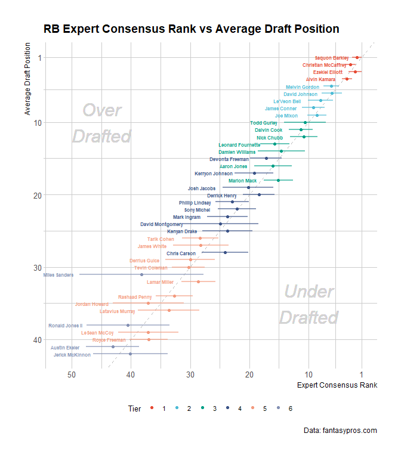

<!-- README.md is generated from README.Rmd. Please edit that file -->

# fantasypros

<!-- badges: start -->

[](https://www.tidyverse.org/lifecycle/#maturing)
<!-- badges: end -->

The goal of `fantasypros` is to provide easy and reproducable access to
data provided on [fantasypros](https://www.fantasypros.com). The intital
focus is on NFL and fantasy football data, but other sports are planned
to be added

## Installation

You can install the released version of fantasypros from
[CRAN](https://CRAN.R-project.org) with:

``` r
# not on CRAN
install.packages("fantasypros")
```

And the development version from [GitHub](https://github.com/) with:

``` r
# install.packages("devtools")
devtools::install_github("jpiburn/fantasypros")
```

## Example

This is a basic example which shows you how to solve a common problem:

## Visualizing Expert Consensus Ranking

``` r
library(fantasypros)
library(ggplot2)
library(dplyr)

fp_draft_rankings("RB") %>%
  filter(rank <= 40) %>%
  ggplot(
    aes(x = avg, y = adp, colour = factor(tier), label = player)
  ) +
  geom_abline(
    slop = 1, 
    intercept = 0,
    linetype = 2,
    color = "grey"
  ) +
  geom_errorbarh(
    aes(xmin = avg - std_dev, xmax = avg + std_dev), 
    height = 0, 
    alpha = 0.6, 
    size = 0.9,  
    show.legend = FALSE
  ) +
  geom_point(size = 1.5) +
  scale_x_reverse(
    breaks = c(1, seq(10,70, 10))
  ) +
  scale_y_reverse(
    breaks = c(1, seq(10,60, 10))
  ) +
  ggsci::scale_color_npg() +
  hrbrthemes::theme_ipsum_rc(
    base_size = 10, 
    axis_title_size = 9,
    plot_title_size = 14
  ) +
  labs(
    title   = "RB Expert Consensus Rank vs Average Draft Position",
    colour  = "Tier",
    x       = "Expert Consensus Rank",
    y       = "Average Draft Position",
    caption = "Data: fantasypros.com"
  ) + 
  geom_text(
    aes(x = avg + std_dev), 
    size = 2, 
    nudge_x = -3.5, 
    show.legend = FALSE,
    fontface = "bold"
  ) +
  geom_text(
    aes(x = 10, y = 35), label = "Under\nDrafted", color = "light grey", 
    size = 8, family = "Roboto Condensed", fontface = "italic"
  ) +
  geom_text(
    aes(x = 45, y = 10), label = "Over\nDrafted", color = "light grey", 
    size = 8, family = "Roboto Condensed", fontface = "italic"
  ) +
  theme(
    legend.position = "bottom",
  ) +
  guides(
    colour = guide_legend(nrow = 1)
  )
```



## Season Stats

``` r
library(fantasypros)

fp_stats("RB", season = 2018, start_week = 3, end_week = 8)
#> # A tibble: 332 x 23
#>    player pos   team  season start_week end_week scoring rushing_att
#>    <chr>  <chr> <chr>  <dbl>      <dbl>    <dbl> <chr>         <dbl>
#>  1 Aaron~ RB    ATL     2018          3        8 half              0
#>  2 Adria~ RB    WAS     2018          3        8 half            251
#>  3 Ahman~ RB    GB      2018          3        8 half              0
#>  4 Alber~ RB    JAC     2018          3        8 half              0
#>  5 Alvin~ RB    TEN     2018          3        8 half              0
#>  6 Antho~ RB    WAS     2018          3        8 half              0
#>  7 Anton~ RB    LAR     2018          3        8 half              0
#>  8 B.J. ~ RB    TB      2018          3        8 half              0
#>  9 Brad ~ RB    CAR     2018          3        8 half              0
#> 10 Carey~ RB    WAS     2018          3        8 half              0
#> # ... with 322 more rows, and 15 more variables: rushing_yds <dbl>,
#> #   rushing_y_a <dbl>, rushing_lg <dbl>, rushing_20 <dbl>,
#> #   rushing_td <dbl>, receiving_rec <dbl>, receiving_tgt <dbl>,
#> #   receiving_yds <dbl>, receiving_y_r <dbl>, receiving_td <dbl>,
#> #   fl <dbl>, g <dbl>, fpts <dbl>, fpts_g <dbl>, own <dbl>
```

## Weekly Snap Counts

``` r
library(fantasypros)

fp_snap_counts(season = 2018)
#> # A tibble: 505 x 23
#>    player pos   team  season    w1    w2    w3    w4    w5    w6    w7
#>    <chr>  <chr> <chr>  <dbl> <dbl> <dbl> <dbl> <dbl> <dbl> <dbl> <dbl>
#>  1 Aaron~ QB    GB      2018    46    77    69    76    81    71    NA
#>  2 Adria~ RB    WAS     2018    42    25    32    NA    13    37    34
#>  3 Alex ~ QB    WAS     2018    79    74    61    NA    61    70    60
#>  4 Ben R~ QB    PIT     2018    84    82    66    62    60    73    NA
#>  5 Benja~ TE    NE      2018    51    54    45    37    36     0    36
#>  6 Brian~ QB    NE      2018     0     0     0     4     0     0     0
#>  7 Chad ~ QB    KC      2018     0     0     0     0     0     0     0
#>  8 Chase~ QB    CHI     2018     0     0     0     3    NA     0     1
#>  9 Danny~ WR    DET     2018    45    44    31    42    53    75    55
#> 10 Delan~ TE    TEN     2018    39     0     0     0     0     0     0
#> # ... with 495 more rows, and 12 more variables: w8 <dbl>, w9 <dbl>,
#> #   w10 <dbl>, w11 <dbl>, w12 <dbl>, w13 <dbl>, w14 <dbl>, w15 <dbl>,
#> #   w16 <dbl>, w17 <dbl>, ttl <dbl>, avg <dbl>

fp_snap_counts(pos = "defense", season = 2018, percentage = TRUE)
#> # A tibble: 769 x 23
#>    player pos   team  season    w1    w2    w3    w4    w5    w6    w7
#>    <chr>  <chr> <chr>  <dbl> <dbl> <dbl> <dbl> <dbl> <dbl> <dbl> <dbl>
#>  1 Patri~ CB    ARI     2018    99   100    99    98    97   100    98
#>  2 Adria~ DE    ATL     2018    30    30    42    37    51    33    40
#>  3 Princ~ CB    CHI     2018    98   100    50     0    NA    67    98
#>  4 Marce~ DT    JAC     2018    65    75    68    57    66    60    53
#>  5 Camer~ DE    PIT     2018    85    86    73    74    71    80    NA
#>  6 Von M~ LB    DEN     2018    88    77    68    68    74    70    85
#>  7 Rober~ DE    DAL     2018    59    51    71    56    68    71    58
#>  8 J.J. ~ DE    HOU     2018    93   100    84    87    90    87    90
#>  9 Justi~ DE    IND     2018    77    85    94    97    27     0     0
#> 10 Ryan ~ LB    WAS     2018    68    82    83    NA    73    80    74
#> # ... with 759 more rows, and 12 more variables: w8 <dbl>, w9 <dbl>,
#> #   w10 <dbl>, w11 <dbl>, w12 <dbl>, w13 <dbl>, w14 <dbl>, w15 <dbl>,
#> #   w16 <dbl>, w17 <dbl>, ttl <dbl>, avg <dbl>
```

## Detailed Snap Analysis

``` r
library(fantasypros)

# all offensive positions for weeks 5-9 of the 2018 season
fp_snap_analysis(season = 2018, start_week = 5, end_week = 9)
#> # A tibble: 423 x 17
#>    player pos   team  season start_week end_week scoring games snaps
#>    <chr>  <chr> <chr>  <dbl>      <dbl>    <dbl> <chr>   <dbl> <dbl>
#>  1 Aaron~ QB    GB      2018          5        9 half        4   278
#>  2 Adria~ RB    WAS     2018          5        9 half        5   157
#>  3 Alex ~ QB    WAS     2018          5        9 half        5   328
#>  4 Ben R~ QB    PIT     2018          5        9 half        4   283
#>  5 Benja~ TE    NO      2018          5        9 half        4   119
#>  6 Brian~ QB    NE      2018          5        9 half        1     2
#>  7 Chase~ QB    CHI     2018          5        9 half        2     4
#>  8 Danny~ WR    MIA     2018          5        9 half        5   295
#>  9 DeSea~ WR    TB      2018          5        9 half        4   155
#> 10 Drew ~ QB    NO      2018          5        9 half        4   258
#> # ... with 413 more rows, and 8 more variables: snaps_gm <dbl>,
#> #   snap_percent <dbl>, rush_percent <dbl>, tgt_percent <dbl>,
#> #   touch_percent <dbl>, util_percent <dbl>, fantasy_pts <dbl>,
#> #   pts_100_snaps <dbl>
```

## Weekly Targets

``` r
library(fantasypros)

# total targets for TE's in the 2014 season
fp_targets(pos = "TE", season = 2014)
#> # A tibble: 134 x 22
#>    player team  season    w1    w2    w3    w4    w5    w6    w7    w8
#>    <chr>  <chr>  <dbl> <dbl> <dbl> <dbl> <dbl> <dbl> <dbl> <dbl> <dbl>
#>  1 Zach ~ SEA     2014     4     1     2    NA    NA    NA    NA    NA
#>  2 Luke ~ SEA     2014     1     0     0    NA     4     6     0     4
#>  3 Andre~ GB      2014     4     2     5     0     2     5     1     3
#>  4 Ryan ~ CLE     2014     0     0     0     0     0     0     0     0
#>  5 Richa~ GB      2014     0     1     0     2     1     0     2     5
#>  6 Antho~ KC      2014     6     4     2     1     7    NA     1     4
#>  7 Travi~ KC      2014     5     6     4     9     3    NA     4     6
#>  8 Taylo~ TEN     2014     2     1     1     0     0     0     0     0
#>  9 Delan~ TEN     2014     4    14     7     7     4     8     5     9
#> 10 Beau ~ TEN     2014     0     0     0     0     0     0     0     0
#> # ... with 124 more rows, and 11 more variables: w9 <dbl>, w10 <dbl>,
#> #   w11 <dbl>, w12 <dbl>, w13 <dbl>, w14 <dbl>, w15 <dbl>, w16 <dbl>,
#> #   w17 <dbl>, ttl <dbl>, avg <dbl>
```
